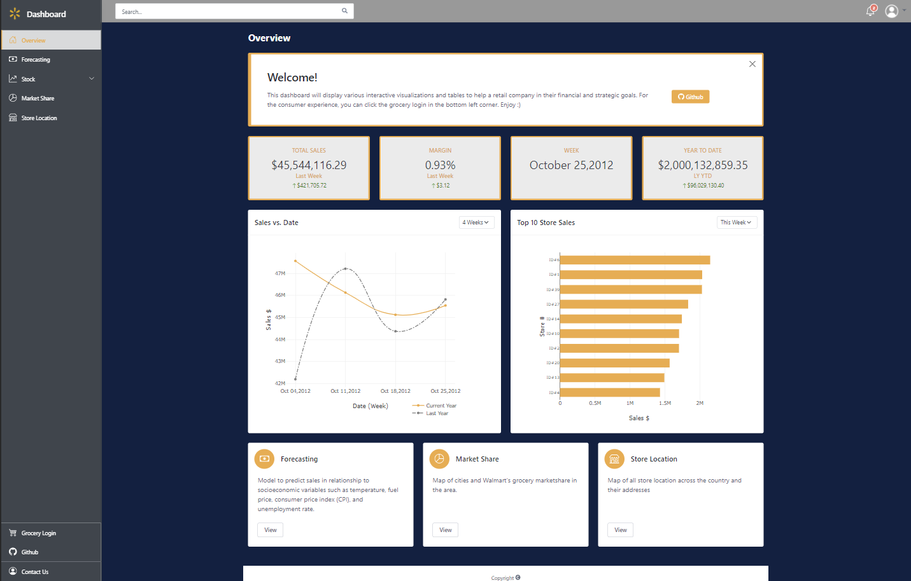
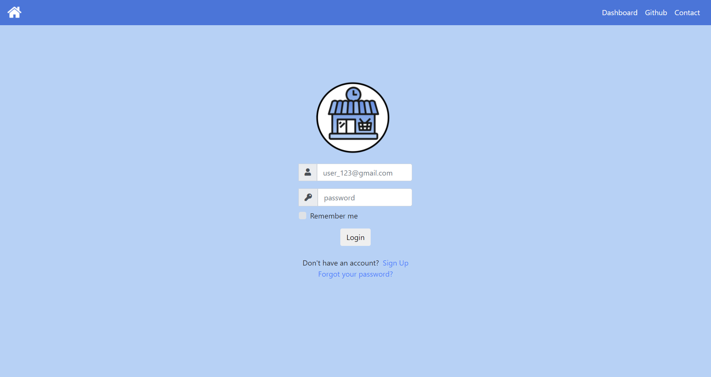
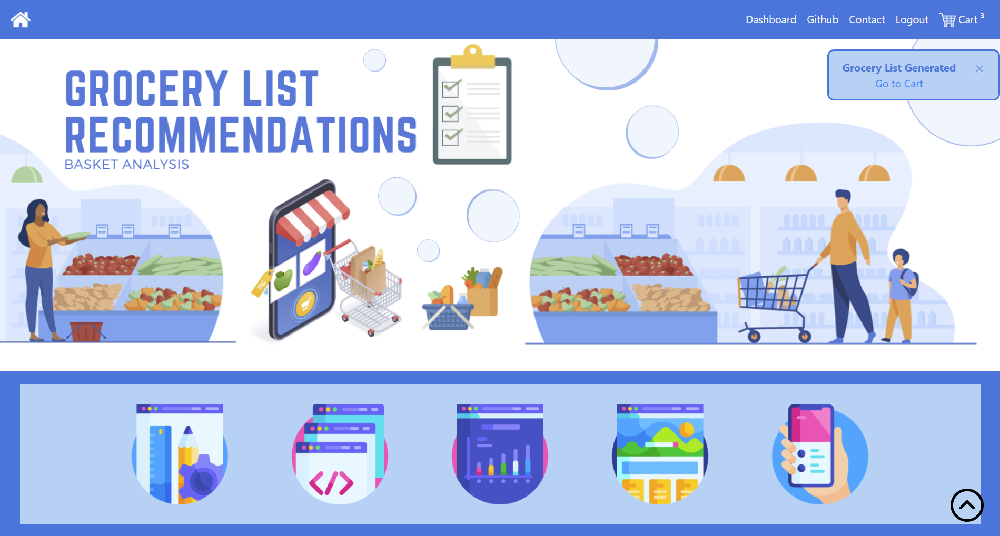
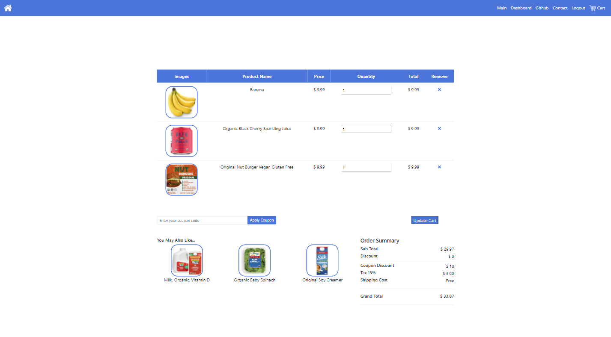

# Retail Machine Learning

## Team Members

- Rebecca Pham
- May Lacdao
- Elizabeth Salas Martinez
- Hanieh Babaee
- Ronald Clarke

Deploy: https://retail-ml.herokuapp.com/

## Objective

For this project, we decided to build on our two previous projects (ETL Project and Project 2). We will be incorporating machine learning algorithms to:

1. Predict Walmart's stock price
2. Create a grocery recommendation system
3. Forecast sales

## Sections

### Stock Price Prediction

Data: https://www.kaggle.com/aayushkandpal/walmart-inc-stock-data-19722020-latest

Facebook Prophet 

- run stock price vs date
- run stock volume vs date
- run (stock price vs volume) vs date
- graph stock data, prediction (line, area graph)

### Grocery Basket Customer Recommendations

Data: https://www.kaggle.com/psparks/instacart-market-basket-analysis

A. Grocery List Recommendation:

- Load csv file, build a clustering/classification model 
- Webscrape/API google images, use chrome driver searching the word/food item and just taking the copy link address of the first search results, adding the csv file 
- HTML, search a member number and the product suggestion will load 

B. Other Product Recommendations:

- Additional Feature: “People Who Bought... Also bought...”
- Getting a unique list of product bought, getting the next top count item that were bought with it, max 3 suggestions 

### Sales Forecasting

Data: https://www.kaggle.com/naresh31/walmart-recruiting-store-sales-forecasting

A. Sales vs. SocioEconomic Target

- Regression on Sales vs SocioEconomic Variables (No Date)
- Regression to see if there’s relationship between sales and socioeconomic variables
- Graph against the variables to see if there’s any relationship

B. Facebook Prophet Sales vs Date

- If there’s no relationship above, you can use facebook prophet
- Graph a line/area graph with the sales and predictions
